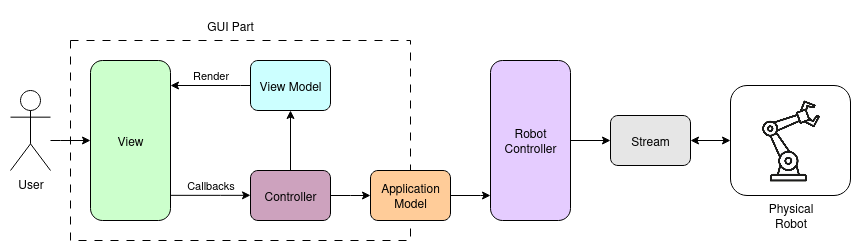

# Robot Terminal

Данный Python проект предназначен для взаимодействия с условным роботом компании
Робопро.

- [Robot Terminal](#robot-terminal)
  - [Описание проекта](#описание-проекта)
  - [Установка проекта](#установка-проекта)
    - [Для пользователей](#для-пользователей)
      - [Установка зависимостей автоматически с использованием uv (рекомендуется)](#установка-зависимостей-автоматически-с-использованием-uv-рекомендуется)
      - [Установка зависимостей вручную (не рекомендуется)](#установка-зависимостей-вручную-не-рекомендуется)
    - [Для разработчиков](#для-разработчиков)
  - [Запуск проекта](#запуск-проекта)
  - [Описание сценариев make](#описание-сценариев-make)

## Описание проекта

Проект реализует клиент для взаимодействия с условным роботом по протоколу UDP.  
Архитектура системы представлена на картинке:



Компонент `Physical Robot` является внешней системой или устройством, общение с
которым производится через канал связи, именуемый `Stream`. `Robot Controller`
использует `Stream` для получения данных от `Physical Robot`, которые в
дальнейшем использует для расчета прямой задачи кинематики для конкретного
компонента `Robot`. Компонент `Robot` на схеме не показан, он позволяет
"собрать" робота из звеньев с заданными параметрами.

Далее начинается часть системы, отвечающая за отображение графического
интерфейса, который реализован на основе MVVM подобной архитектуре.
`Application Model` является связующим звеном между бизнес-логикой и графическим
интерфейсом и скрывает подробности реализации низкоуровневой части от GUI.
`Controller` отвечает за обработку событий пользовательского интерфейса и вызов
соответствующих методов `Application Model`, результаты выполнения которых
подаются во `View Model`. Компонент `View Model` хранит независимое от
графического фреймворка состояние графического интерфейса. `View` реализует слой
представления и занимается рендерингом `View Model`.

Конфигурация робота и канала связи вынесена в отдельные файлы конфигурации
(в директории `./config/*`) и может быть легко изменена при необходимости.

## Установка проекта

### Для пользователей

#### Установка зависимостей автоматически с использованием uv (рекомендуется)

Сначала необходимо установить
[uv](https://docs.astral.sh/uv/getting-started/installation/) - менеджер
проектов python.

После этого установить зависимости проекта можно с помощью команды:

```bash
uv sync --no-dev
```

В конце, необходимо получить экземпляр терминала, из которого следует запускать
исполняемые файлы:

```bash
source ./.venv/bin/activate # Для bash и ему подобных
source ./.venv/bin/activate.fish # Для fish
```

#### Установка зависимостей вручную (не рекомендуется)

Необходимо создать виртуальную среду с версией python 3.11 (любым удобным вам
способом) и установить в нее необходимые зависимости. Для установки зависимостей
вручную в терминале необходимо выполнить команду:

```bash
pip install -r requirements.txt
```

### Для разработчиков

Для комфортного процесса разработки рекомендуется настроить инфраструктуру для разработки.

Предварительно необходимо установить менеджер проектов
[uv](https://docs.astral.sh/uv/getting-started/installation/).

Далее необходимо инициализировать виртуальную среду следующей командой:

```bash
uv sync
```

Она создаст виртуальную среду python 3.11 и установит все зависимости
проекта (в том числе и для разработки). Далее работать следует исключительно из
виртуальной среды, терминал с которой можно получить с помощью команды:

```bash
source ./.venv/bin/activate # Для bash ему подобных
source ./.venv/bin/activate.fish # Для fish
```

Наконец, следует установить pre-commit хук на репозиторий.
Это добавит процедуру форматирования исходных файлов и
запуск линтера перед каждым коммитом.

```bash
pre-commit install
```

## Запуск проекта

Для запуска проекта необходимо:
1. Установить [зависимости](#для-пользователей)
2. Запустить проект, выполнив одно из перечисленных действий:
    * Выполнить команду `make run`
    * Активировать виртуальную среду, а затем запустить приложение командой `./start_robot_terminal.py`


## Описание сценариев make

* (uv run) make test --- вызов unit тестов
* (uv run) make lint --- линтинг исходных файлов
* (uv run) make format --- автоформатирование исходных файлов
* (uv run) make requirements --- обновление файла requirements.txt
* make server --- компиляция сервера
* make run --- запуск проекта